This was my first React Native project, through which I gained hands-on experience in mobile app development and learned key concepts of building real-world applications. The main goal of this project is to streamline and simplify the Final Year Project (FYP) process, making it more efficient and user-friendly for students, especially during the selection of FYP advisors. The application uses Firebase as a backend to store and manage all data, including user information, project details, and scheduling. Since the project scope was moderate, I used Expo for faster development and easier deployment. The application is cross-platform and can run on web, Android, and iOS devices.
 Screenshots

  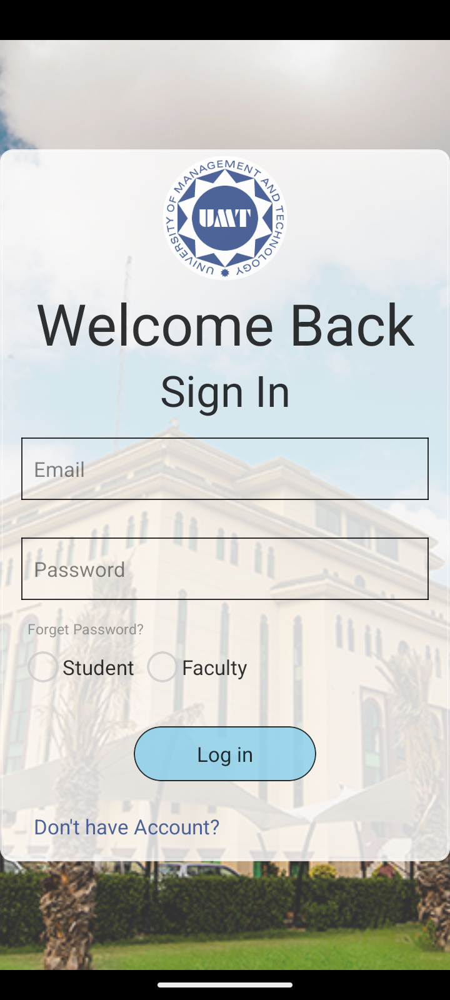
  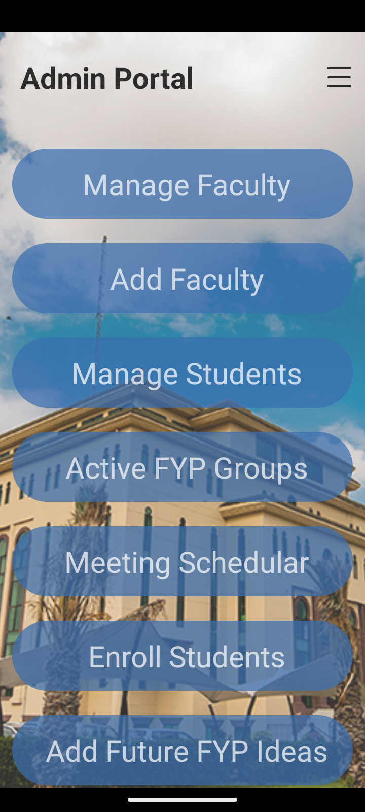
  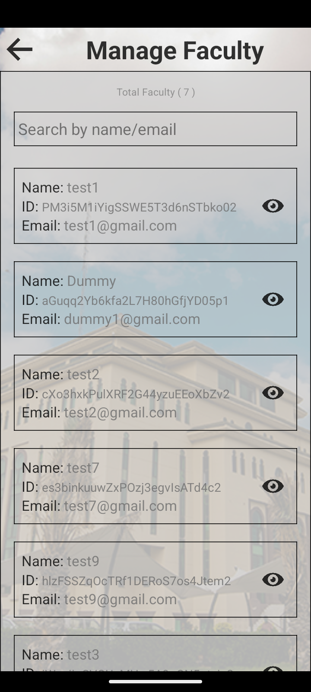
  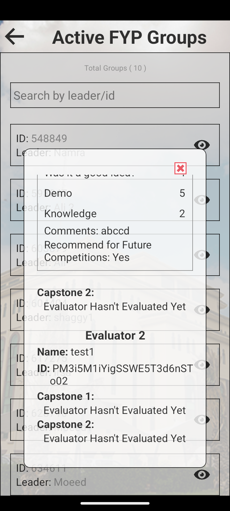
  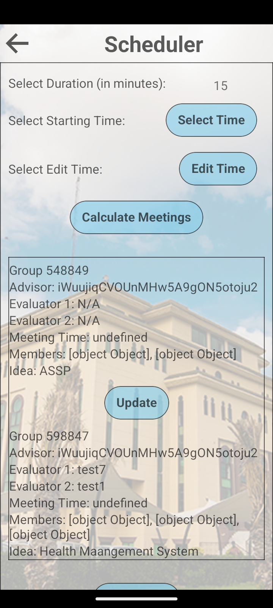
  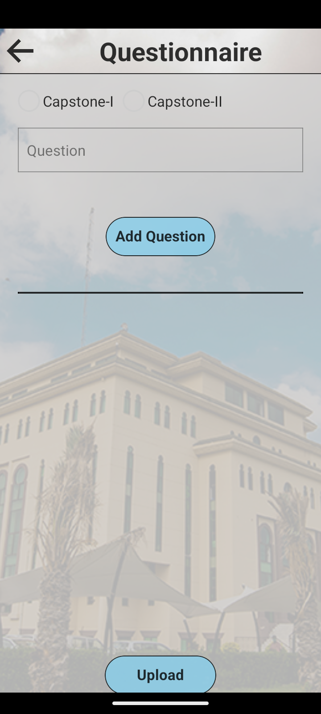
  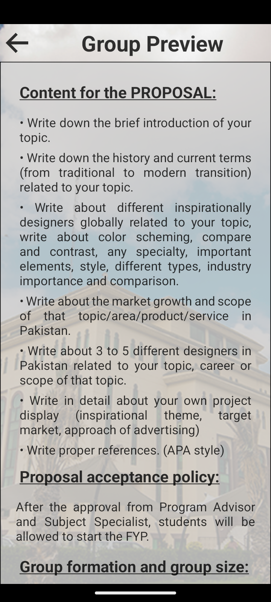
  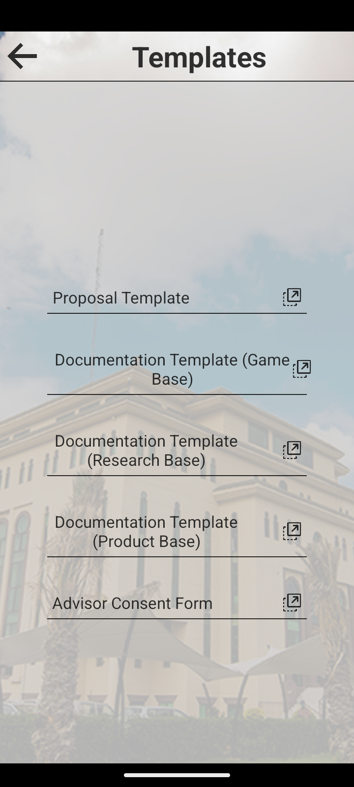
  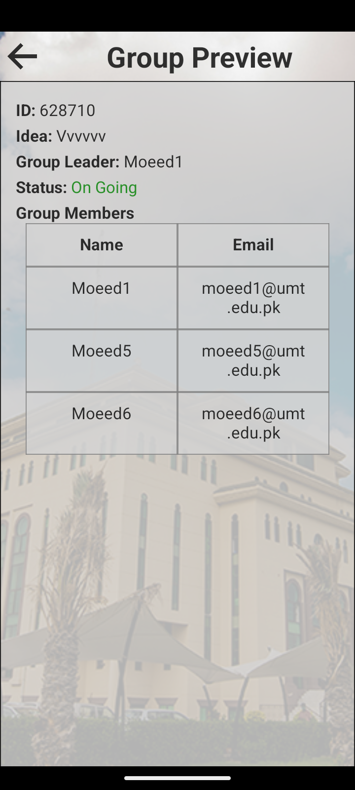
  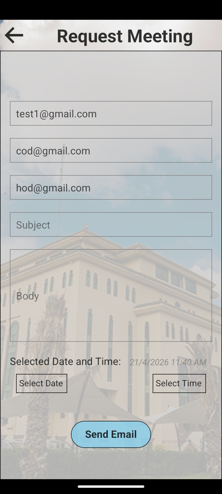
  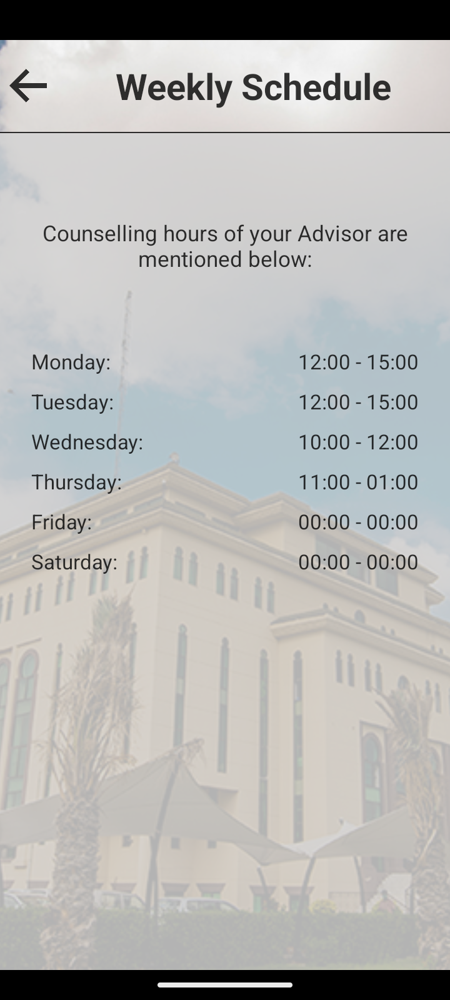

 

