# Automated FYP System

This is my final year project from my bachelor's at the University of Management and Technology (UMT), Lahore. It was also my first React Native app, so a lot of what I know about mobile development I picked up while building it.

The idea came from our own FYP experience. Finding an advisor, forming a group, submitting proposals and setting up meetings was mostly done through emails and paperwork, and it got messy. So I built an app where students, faculty and the FYP admin can handle all of it in one place.

## What it does

There are three types of users, each with their own portal.

**Students** can register their FYP group, look through the available advisors, submit proposals and check their old ones. They can also download the official templates (proposal, documentation, consent form), read the FYP guidelines, see future project ideas, check their advisor's counselling hours, request a meeting and chat with their advisor.

**Faculty** can accept or reject proposals, keep track of their active groups, assign evaluators, set their counselling hours and evaluate groups in Capstone I and II. They can also email or chat with students directly.

**Admin** manages faculty, students and groups. Faculty can be added in bulk through an Excel file, and the admin can enroll students, generate the evaluation meeting schedule for all groups automatically, create the evaluation questionnaire and post future FYP ideas.

## Built with

- React Native
- Firebase (Authentication, Firestore, Storage)
- React Navigation

## Screenshots

<table>
  <tr>
    <td align="center">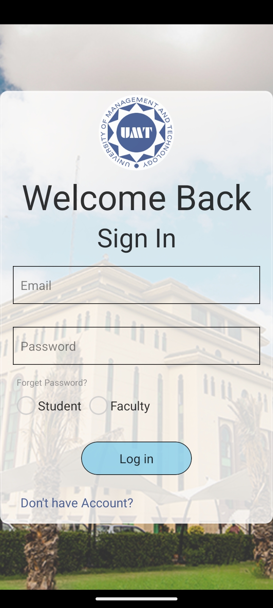 Login</td>
    <td align="center">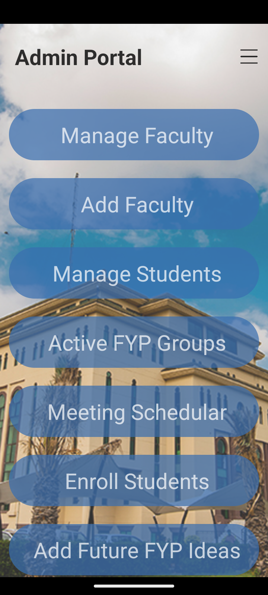 Admin Portal</td>
    <td align="center">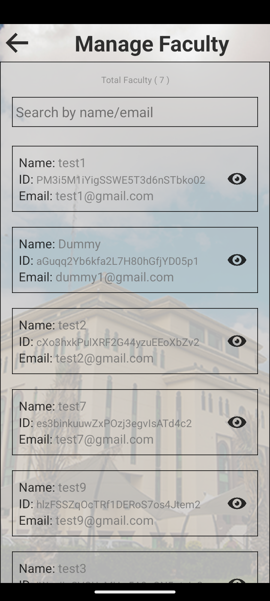 Manage Faculty</td>
    <td align="center">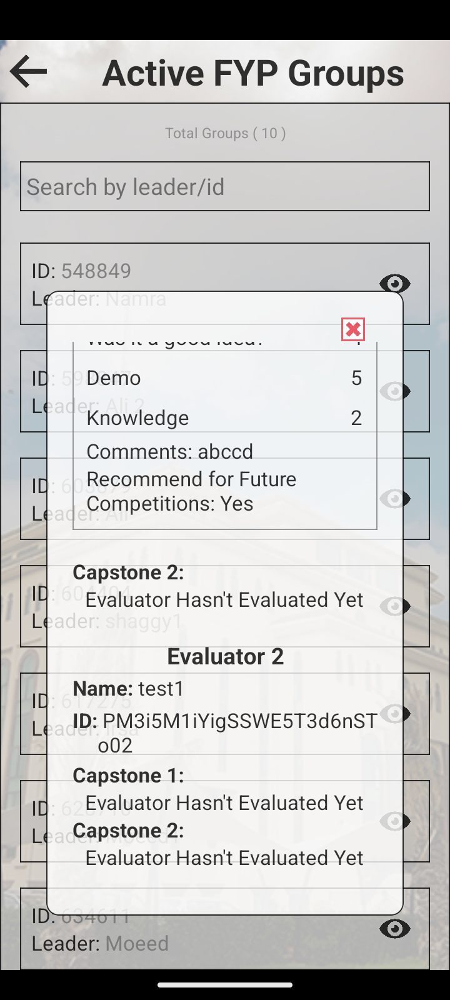 Group Evaluations</td>
  </tr>
  <tr>
    <td align="center">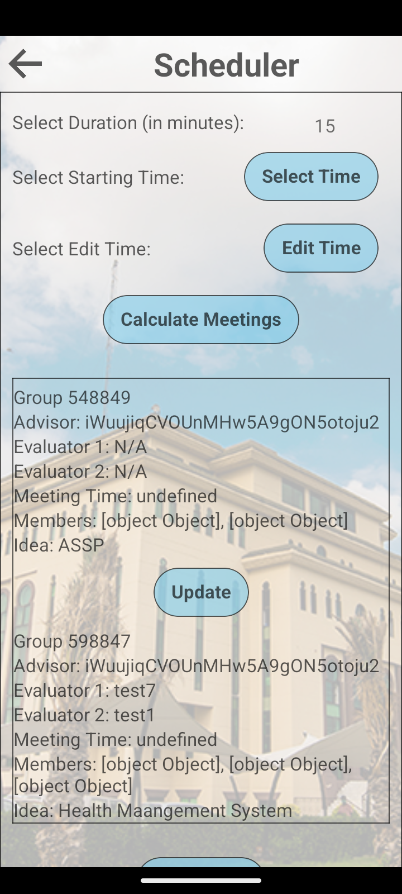 Meeting Scheduler</td>
    <td align="center">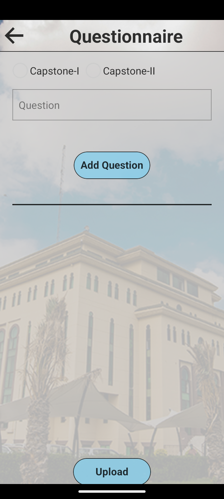 Questionnaire</td>
    <td align="center">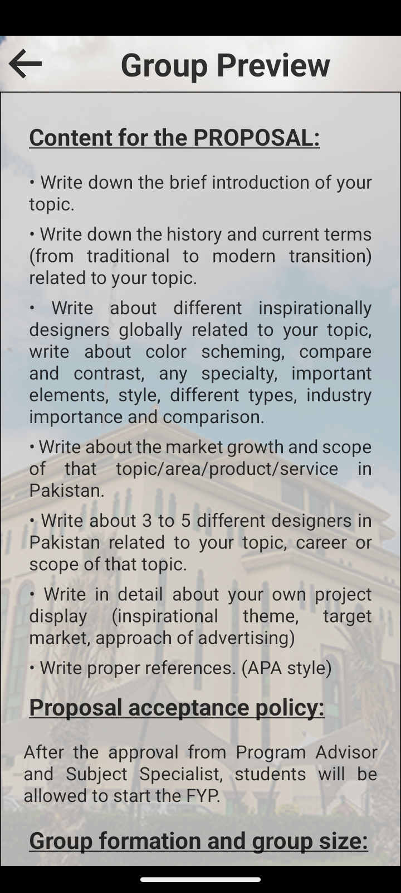 FYP Guidelines</td>
    <td align="center">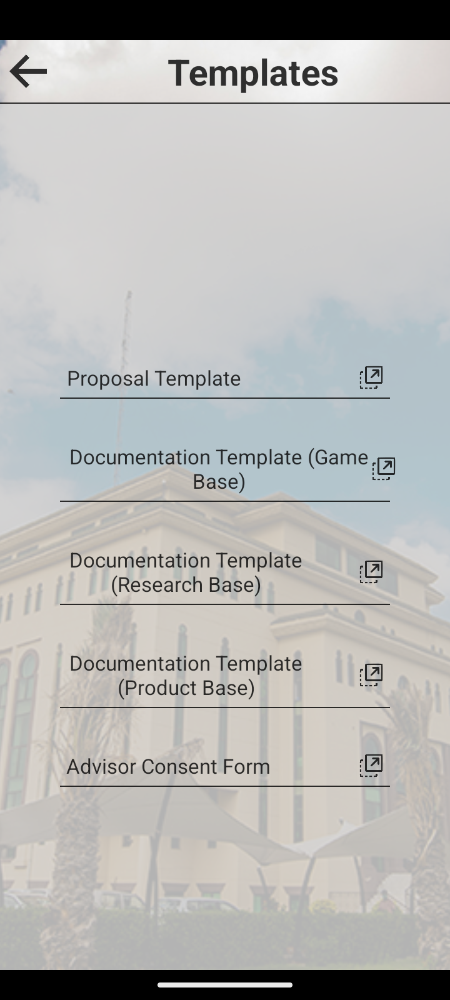 Templates</td>
  </tr>
  <tr>
    <td align="center">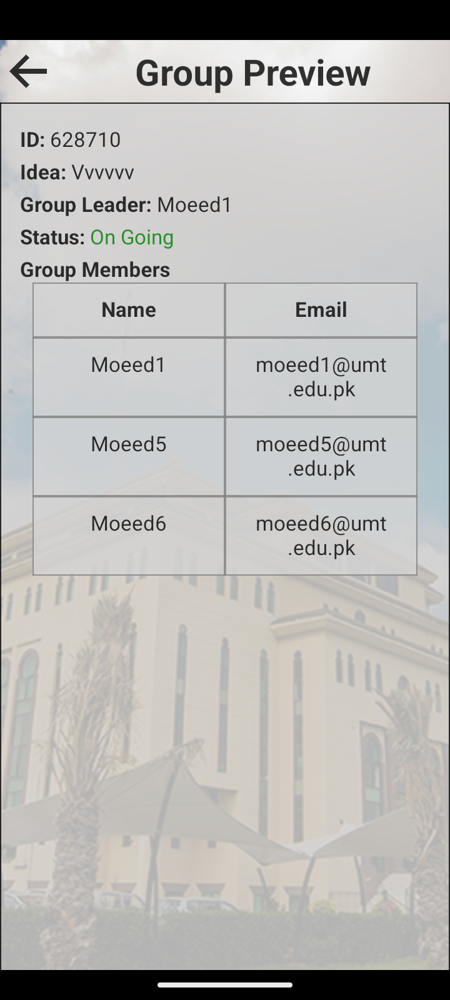 Group Preview</td>
    <td align="center">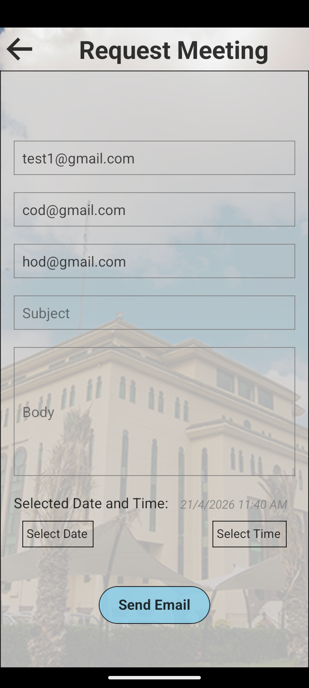 Request Meeting</td>
    <td align="center">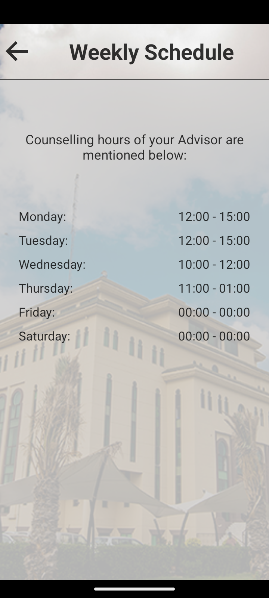 Counselling Hours</td>
    <td></td>
  </tr>
</table>
